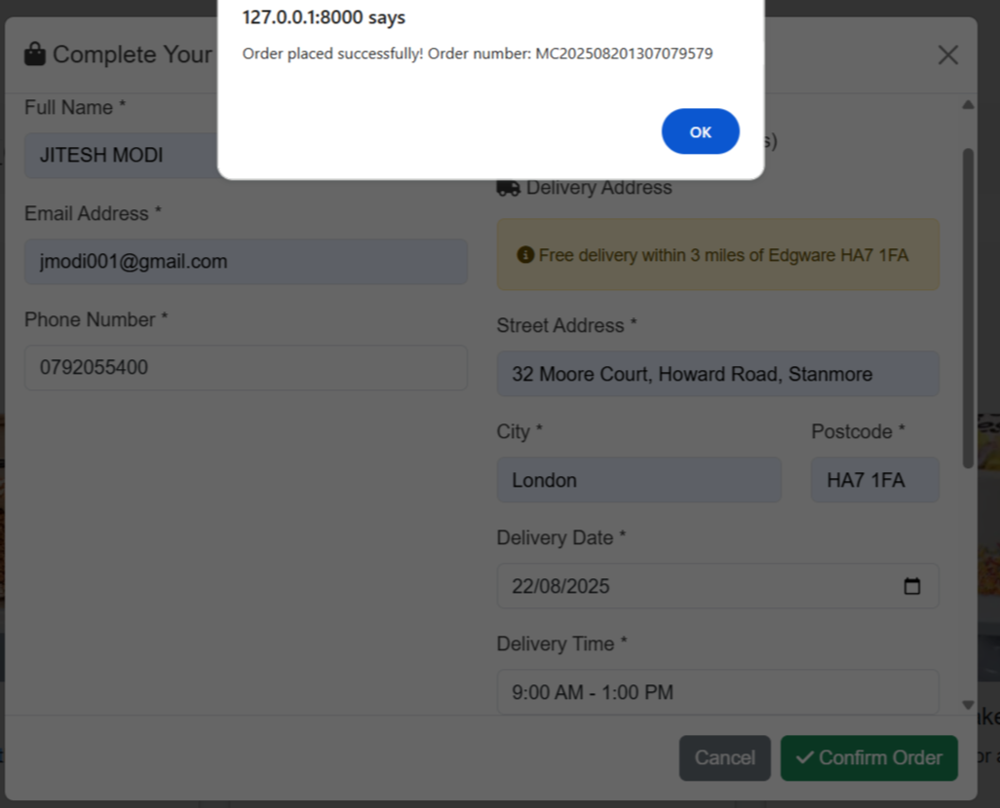

# Mammas-Cakes

Mammas Cakes is an e-commerce website project created for a imaginary bake shop in UK. The main goal of this project was to create the most user-friendly website possible, where you can shop for cakes in an easy and intuitive way. The user can view collection of products, place an order  as a collection or delivery . Users need to register their login credentials and be authenticated before placing an order. Registered users also have the option to view their order history  

Project was created using Python, Django, HTML5, CSS3, and JavaScript. The data was stored in a PostgreSQL database manipulation and deployed using Heroku. Mammas Cakes is my third milestone project for Code Institute's Level 5 Diploma in Web Application Development. 

[View the live site](
https://git.heroku.com/mammas-cakes.git/)

# Table content
* [UX & 5 Placen of Webiste Design](#ux-and-five-planes-of-website-design)
    * [Strategy](#strategy)
    * [Scope](#scope)
    * [Structure](#structure)
    * [Skeleton](#skeleton)
    * [Surface](#surface)
* [Features](#features)
    * [Home Page](#home-page)
    * [Product Page](#products-page)
    * [Shopping Bag](#shopping-bag)
    * [Checkout](#checkout)
    * [Profile Page](#profile-page)
    * [Management Site](#management-site)
    * [Contact Form](#contact-form)
    * [Authentication](#authentication)
    * [Error Page](#error-page)
* [Technologies](#technologies-used)
* [Testing](#testing)
  * [Validation](#validation)
    * [HTML Validation](#html-validation)
    * [CSS Validation](#css-validation)
    * [JavaScript Linting](#javascript-linting)
    * [Python Linting](#python-linting)
    * [Lighthouse Testing](#lighthouse-testing)
    * [Wave Testing](#wave-testing)
* [Responsiveness](#responsiveness)
* [Manual Testing](#manual-testing)
* [User Stories Testing](#user-stories-testing)
* [Bugs, Issues and Solutions](#bugs-issues-and-solutions)

* [Deployment](#deployment)
* [Credits](#credits)

  # UX and Five Planes of Website Design

## Strategy

### User stories

1. As a first time user I want to:
* Immediately understand the main purpose and use of the site
* Be able easily navigate through the site
* Select navigation links of products offered
* View collection of each product type
* Contact the company regarding any queries
* Be able use the page on any devices and screen sizes
* View Social media links and pages from the site
* Register a customer account

2. As a registered user I want to:
* Place an order for my desired product
* Complete my order details
* Complete a collection or delivery order
* Receivie confirmation of my order on screen and as an email.
* View my Order History
* Be able to change my password, if I have forgotten my login details

3. As an admin I want to:
* Be able to add, edit and delete cakes
* Able  to edit user profile details
* Be able to view customer cake orders
* Be able to reset customer passwords
* Have easy access to admin controls

# Features

## Home Page

Home Page

 Site is opened on this page

Product

Customers can view selection of cakes on offer, ranging from Birthday, Wedding, Treats and Vegan Cakes.

Login

 Customer are required to login before placing an order

Create Order

Customers need to complete all fields before submitting their order

Order Confirm

Once order has been submitted, customers receive a confirm alert on screen

Email Confirmation

Once order has been submitted, customers receive an email confirmation

Order History

 Customer can view their orders whilst logged in to their profile

Registration

 It's mandatory for customers to register, if they already heavent to place an orde

Password Reset

 Customers can request a password reset should they forget their login details. Entering an email address registered on our system will enable them to receive a password reset link to reset their password.

Contact Us

 Customer can contact the firm about any query via the form

Contact Mail Confirmation

 Confirmation the business has received a contact request query
## Admin Page
Site Administrators only have priveleges to modify the site, add products, manage customer orders using super user login credentials. Please see below the 

Admin Site Login

 Administrators can login via the site home page using their super user credentials.

Site Administration

 Administrators can manage this section to add and remove cake products, add, change and remove customer information an and manage customer orders.

Cake Admin

 Administrators can add and remove cake products via the cakes link

View Orders

 Administrators canv view orders arrived through the site.

Change Order

 Admins can change the order. Very useful and repetitive when changing status of an order from pending to available to collect or delivered.
 

# Testing 

# Validation 
## HTML Validation
Variious html pages shows a mixture of pass and fails. W3 Validator sees % extends cake/base.html' % and does not recognize. Validator cannot parse Django Syntax. By creating a static template to pass validaton, would miss template inheritance and dynamic content. Using page source, rendered html and pasting code into html validator returns 0 error and warnings.All pages show no errors when entered 

| Template                    | Result                                                                                                                                                                                                                                                                                                                | Pass/Fail | Reason for Fail                                        |
| --------------------------- | --------------------------------------------------------------------------------------------------------------------------------------------------------------------------------------------------------------------------------------------------------------------------------------------------------------------- | --------- | ------------------------------------------------------ |
| Base.html                   | Non space errors found, element missing head, strey doc type, stray startup                                                                                                                                                                                                                                           | Fail      | because W3 validator not understanding django template |
| Home                        | Non space value, bad attributes src on elements                                                                                                                                                                                                                                                                       | Fail      | because W3 validator not understanding django template |
| Products                    | Fail                                                                                                                                                                                                                                                                                                                  | Fail      | because W3 validator not understanding django template |
| Birthday                    | Non space errors found, element missing head, bad value for attribute on element                                                                                                                                                                                                                                      | Fail      | because W3 validator not understanding django template |
| Wedding                     | Non space errors found, element missing head, bad value for attribute on element                                                                                                                                                                                                                                      | Fail      | because W3 validator not understanding django template |
| Treats                      | Non space errors found, element missing head, bad value for attribute on element                                                                                                                                                                                                                                      | Fail      | because W3 validator not understanding django template |
| Vegan                       | Non space errors found, element missing head, bad value for attribute on element                                                                                                                                                                                                                                      | Fail      | because W3 validator not understanding django template |
| Signup                      | No Warnings                                                                                                                                                                                                                                                                                                           | Pass      |                                                        |
| Register                    | No Warnings                                                                                                                                                                                                                                                                                                           | Pass      |                                                        |
| Login                       | No Warnings                                                                                                                                                                                                                                                                                                           | Pass      |                                                        |
| Order Confirmation Email    | No Warnings                                                                                                                                                                                                                                                                                                           | Pass      |                                                        |
| Order History               | No Warnings                                                                                                                                                                                                                                                                                                           | Pass      |                                                        |
| Order Detail                | No Warnings                                                                                                                                                                                                                                                                                                           | Pass      |                                                        |
| Order Confirmation          | No Warnings                                                                                                                                                                                                                                                                                                           | Pass      |                                                        |
| Password reset request      | Non space errors found, element missing head, bad value for attribute on element                                                                                                                                                                                                                                      | Fail      | because W3 validator not understanding django template |
| Password reset confirmation | Non space errors found, element missing head, bad value for attribute on element                                                                                                                                                                                                                                      | Fail      | because W3 validator not understanding django template |
|                             | W3 Validator sees % extends cake/base.html' % and does not recognize. Validator cannot parse Django Syntax. By creating a static template to pass validaton, would miss template inheritance and dynamic content. Using page source, rendered html and pasting code into html validator returns 0 error and warnings. |           |                                                        |

## CSS Validation
I run the CSS code through [W3C CSS Validator](https://jigsaw.w3.org/css-validator/#validate_by_input) and showed No errors

## JavaScript Linting

JavaScript Linting

 I ran the JavaScript code through [JSHint](https://jshint.com/), I only had one js file to run the code order-system.js. Two warnings  and one undefined bootstrap variables, which have been resolved.

## Python Linter

I ran the code through [CI Python Liner](https://pep8ci.herokuapp.com/), which shows a multiple errors mostly regarding blank lines, missing whitespaces and too long lines, which all were fixed.

| App          | File                   | Result                                       | Fixed |
| ------------ | ---------------------- | -------------------------------------------- | ----- |
| Cakes        | views                  | lines too long (81, 246, 250, 254, 269, 274) | Yes   |
| Cakes        | models                 | line 94 too long                             | Yes   |
| Cakes        | forms                  | line 109, 132 too long                       | yes   |
| Cakes        | admin                  | All ok                                       | yes   |
| Cakes        | urls                   | no new line at end                           | yes   |
| Cakes        | settings               | lines 93, 96, 92 102 too long                | Yes   |
| Migration    | 0001_initial.py        | spacing and long line                        | Yes   |
| Migration    | 00021_order_collection | All ok                                       | yes   |
| Migration    | 0003_order_update      | All ok                                       | yes   |
| Migration    | 0004_alter             | All ok                                       | Yes   |
| Mammas-Cakes | urls.py                | All ok                                       | Yes   |
| Mammas-Cakes | manage.py              | All ok                                       | Yes   |
| Mammas-Cakes | env.py                 | All ok                                       | Yes   |

## Lighthouse Testing
The site was run through Google Chrome Dev Tools Lighthouse. Results were excellent, close to 100% for majority. See below

#### For full results see dropdown below

### Desktop

Home Page

Birthday Cakes

Wedding Cakes

Treats

Vegan Cakes

Order History

Registration

Login

Password Reset

Contact Form

