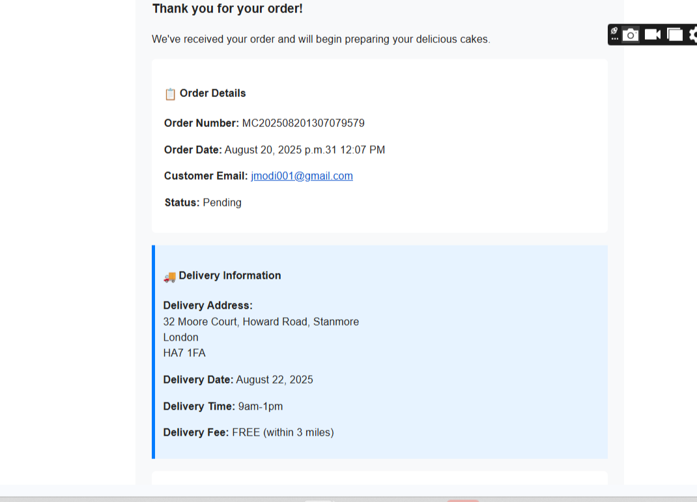
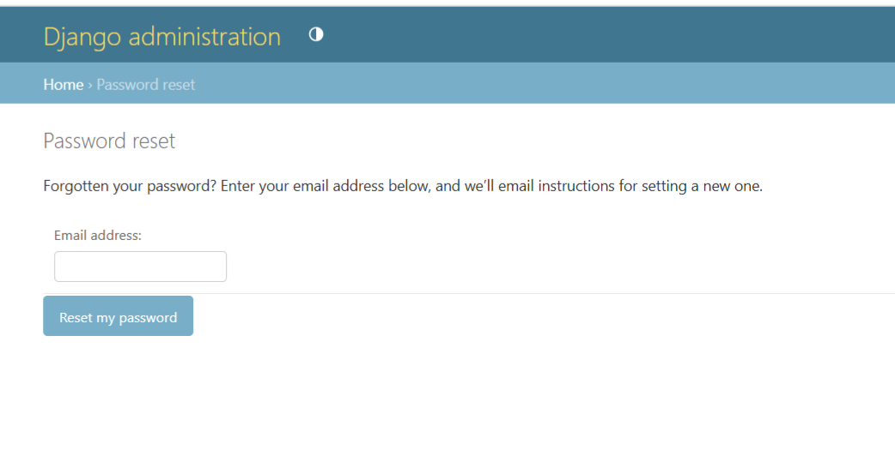

# Mammas-Cakes

Mammas Cakes is an e-commerce website project created for a imaginary bake shop in UK. The main goal of this project was to create the most user-friendly website possible, where you can shop for cakes in an easy and intuitive way. The user can view collection of products, place an order  as a collection or delivery . Users need to register their login credentials and be authenticated before placing an order. Registered users also have the option to view their order history  

Project was created using Python, Django, HTML5, CSS3, and JavaScript. The data was stored in a PostgreSQL database manipulation and deployed using Heroku. Mammas Cakes is my third milestone project for Code Institute's Level 5 Diploma in Web Application Development. 

[View the live site](
https://git.heroku.com/mammas-cakes.git/)

# Table content
* [UX & 5 Placen of Webiste Design](#ux-and-five-planes-of-website-design)
    * [Strategy](#strategy)
    * [Structure](#structure)
    * [Skeleton](#skeleton)
    * [Surface](#surface)
* [Features](#features)
    * [Home Page](#home-page)
    * [Product Page](#products-page)
    * [Profile Page](#profile-page)
    * [Contact Form](#contact-form)
    * [Authentication](#authentication)
* [Technologies](#technologies-used)
* [Testing](#testing)
  * [Validation](#validation)
    * [HTML Validation](#html-validation)
    * [CSS Validation](#css-validation)
    * [JavaScript Linting](#javascript-linting)
    * [Python Linting](#python-linting)
    * [Lighthouse Testing](#lighthouse-testing)
* [Responsiveness](#responsiveness)
* [Manual Testing](#manual-testing)
* [User Stories Testing](#user-stories-testing)
* [Bugs, Issues and Solutions](#bugs-issues-and-solutions)

* [Deployment](#deployment)
* [Credits](#credits)

  # UX and Five Planes of Website Design

## Strategy

### User stories

1. As a first time user I want to:
* Immediately understand the main purpose and use of the site
* Be able easily navigate through the site
* Select navigation links of products offered
* View collection of each product type
* Contact the company regarding any queries
* Be able use the page on any devices and screen sizes
* View Social media links and pages from the site
* Register a customer account

2. As a registered user I want to:
* Place an order for my desired product
* Complete my order details
* Complete a collection or delivery order
* Receivie confirmation of my order on screen and as an email.
* View my Order History
* Be able to change my password, if I have forgotten my login details

3. As an admin I want to:
* Be able to add, edit and delete cakes
* Able  to edit user profile details
* Be able to view customer cake orders
* Be able to reset customer passwords
* Have easy access to admin controls

## Skeleton
### Wireframes

Home Page

Templates

Account Creation

Login

Order Confirm

## Surface

### **Colour** 
The Colour palette is a mixture of 3 colours. Dark blue for the header, white colour for the main body and light blue for the footer.The buttons consists of blue colours too.
 

### **Typography** 

Fonts were imported from [Google Fonts](https://fonts.google.com/). 

I used the "Arial"  as the primary font for the main body and Mocando Cursive as the Secondary font . I found the Aerial font is a simple, user-friendly, outstanding and clean typeface that contributes the design. I chose Mocando Cursive for my headings, because I love the way letters A, M and W stand out in each heading. I was inspired by using 'Mocando' Cursive when I completed the BoardWalk Games site using on the Code Institute learning management system module. https://jmodi16.github.io/boardwalk-games/ .
Colour 'black' is used as the font for the text.

# Features

## Home Page

## User Functionality

Home Page

Site is opened on this page

Product

Customers can view selection of cakes on offer, ranging from Birthday, Wedding, Treats and Vegan Cakes.

Login

 Customer are required to login before placing an order

Create Order

Customers need to complete all fields before submitting their order

Order Confirm

Once order has been submitted, customers receive a confirm alert on screen

Email Confirmation

Once order has been submitted, customers receive an email confirmation

Order History

 Customer can view their orders whilst logged in to their profile

Registration

 It's mandatory for customers to register, if they already heavent to place an orde

Password Reset

 Customers can request a password reset should they forget their login details. Entering an email address registered on our system will enable them to receive a password reset link to reset their password.

Contact Us

 Customer can contact the firm about any query via the form

Contact Mail Confirmation

 Confirmation the business has received a contact request query

 ## Site Admin 
Site Administrators only have priveleges to modify the site, add products, manage customer orders using super user login credentials. Please see below the 

Admin Site Login

 Administrators can login via the site home page using their super user credentials.

Site Administration

 Administrators can manage this section to add and remove cake products, add, change and remove customer information an and manage customer orders.

Cake Admin

 Administrators can add and remove cake products via the cakes link

View Orders

 Administrators canv view orders arrived through the site.

Change Order

 Admins can change the order. Very useful and repetitive when changing status of an order from pending to available to collect or delivered.
 

# Testing 

# Validation 
## HTML Validation
Variious html pages shows a mixture of pass and fails. W3 Validator sees % extends cake/base.html' % and does not recognize. Validator cannot parse Django Syntax. By creating a static template to pass validaton, would miss template inheritance and dynamic content. Using page source, rendered html and pasting code into html validator returns 0 error and warnings.All pages show no errors when entered 

| Template                    | Result                                                                                                                                                                                                                                                                                                                | Pass/Fail | Reason for Fail                                        |
| --------------------------- | --------------------------------------------------------------------------------------------------------------------------------------------------------------------------------------------------------------------------------------------------------------------------------------------------------------------- | --------- | ------------------------------------------------------ |
| Base.html                   | Non space errors found, element missing head, strey doc type, stray startup                                                                                                                                                                                                                                           | Fail      | because W3 validator not understanding django template |
| Home                        | Non space value, bad attributes src on elements                                                                                                                                                                                                                                                                       | Fail      | because W3 validator not understanding django template |
| Products                    | Fail                                                                                                                                                                                                                                                                                                                  | Fail      | because W3 validator not understanding django template |
| Birthday                    | Non space errors found, element missing head, bad value for attribute on element                                                                                                                                                                                                                                      | Fail      | because W3 validator not understanding django template |
| Wedding                     | Non space errors found, element missing head, bad value for attribute on element                                                                                                                                                                                                                                      | Fail      | because W3 validator not understanding django template |
| Treats                      | Non space errors found, element missing head, bad value for attribute on element                                                                                                                                                                                                                                      | Fail      | because W3 validator not understanding django template |
| Vegan                       | Non space errors found, element missing head, bad value for attribute on element                                                                                                                                                                                                                                      | Fail      | because W3 validator not understanding django template |
| Signup                      | No Warnings                                                                                                                                                                                                                                                                                                           | Pass      |                                                        |
| Register                    | No Warnings                                                                                                                                                                                                                                                                                                           | Pass      |                                                        |
| Login                       | No Warnings                                                                                                                                                                                                                                                                                                           | Pass      |                                                        |
| Order Confirmation Email    | No Warnings                                                                                                                                                                                                                                                                                                           | Pass      |                                                        |
| Order History               | No Warnings                                                                                                                                                                                                                                                                                                           | Pass      |                                                        |
| Order Detail                | No Warnings                                                                                                                                                                                                                                                                                                           | Pass      |                                                        |
| Order Confirmation          | No Warnings                                                                                                                                                                                                                                                                                                           | Pass      |                                                        |
| Password reset request      | Non space errors found, element missing head, bad value for attribute on element                                                                                                                                                                                                                                      | Fail      | because W3 validator not understanding django template |
| Password reset confirmation | Non space errors found, element missing head, bad value for attribute on element                                                                                                                                                                                                                                      | Fail      | because W3 validator not understanding django template |
|                             | W3 Validator sees % extends cake/base.html' % and does not recognize. Validator cannot parse Django Syntax. By creating a static template to pass validaton, would miss template inheritance and dynamic content. Using page source, rendered html and pasting code into html validator returns 0 error and warnings. |           |                                                        |

## CSS Validation
I run the CSS code through [W3C CSS Validator](https://jigsaw.w3.org/css-validator/#validate_by_input) and showed No errors

## JavaScript Linting

JavaScript Linting

 I ran the JavaScript code through [JSHint](https://jshint.com/), I only had one js file to run the code order-system.js. Two warnings  and one undefined bootstrap variables, which have been resolved.

## Python Linter

I ran the code through [CI Python Liner](https://pep8ci.herokuapp.com/), which shows a multiple errors mostly regarding blank lines, missing whitespaces and too long lines, which all were fixed.

| App          | File                   | Result                                       | Fixed |
| ------------ | ---------------------- | -------------------------------------------- | ----- |
| Cakes        | views                  | lines too long (81, 246, 250, 254, 269, 274) | Yes   |
| Cakes        | models                 | line 94 too long                             | Yes   |
| Cakes        | forms                  | line 109, 132 too long                       | yes   |
| Cakes        | admin                  | All ok                                       | yes   |
| Cakes        | urls                   | no new line at end                           | yes   |
| Cakes        | settings               | lines 93, 96, 92 102 too long                | Yes   |
| Migration    | 0001_initial.py        | spacing and long line                        | Yes   |
| Migration    | 00021_order_collection | All ok                                       | yes   |
| Migration    | 0003_order_update      | All ok                                       | yes   |
| Migration    | 0004_alter             | All ok                                       | Yes   |
| Mammas-Cakes | urls.py                | All ok                                       | Yes   |
| Mammas-Cakes | manage.py              | All ok                                       | Yes   |
| Mammas-Cakes | env.py                 | All ok                                       | Yes   |

## Lighthouse Testing
The site was run through Google Chrome Dev Tools Lighthouse. Results were excellent, close to 100% for majority. See below

#### For full results see dropdown below

### Desktop

Home Page

Birthday Cakes

Wedding Cakes

Treats

Vegan Cakes

Order History

Registration

Login

Password Reset

Contact Form

# Manual Testing
I conducted comprehensive manual testing on my page, ensuring all functions, links and button functioned correctly. I verified the layout and design, checked the responsivenessreviewed the content for accuracy. All successfully passed the thorough testing, ensuring its user-friendly navigational, form submission functionality and reliability.

User Link Navigation

| Test Page                   | Goal                                                                        | Result |
| --------------------------- | --------------------------------------------------------------------------- | ------ |
| Home Page                   | Cake Collection categories Visible with images and option to view and order | Pass   |
| Cake type Navigation links  | Visible on all page                                                         | Pass   |
| Birthday Cakes link         | All birthday cakes visible with price, description and order button         | Pass   |
| Wedding Cakes link          | All Wedding cakes visible with price, description and order button          | Pass   |
| Treat Cake Link             | All treat cakes visible with price, description and order button            | Pass   |
| Vegan Cake Link             | All  Vegan cakes visible with price, description and order button           | Pass   |
| Register Link               | Opens up registration form                                                  | Pass   |
| Forgotten you password link | Opens window to enter email address                                         | Pass   |
| Order History               | Available whilst logged in                                                  | Pass   |
| Footer                      | Visible on all page                                                         | Pass   |
| Quick links                 | All navigation links functional                                             | Pass   |
| Social networking Links     | All links functional and open up an external page                           | Pass   |
| Contact form                | Fully functional and received by email to mammas.cakes16@gmail.com          | Pass   |

User Functions

| Function                                                  | Goal                                                          | Result |
| --------------------------------------------------------- | ------------------------------------------------------------- | ------ |
| Login Now Button                                          | Opens with login window                                       | Pass   |
| Order Now Button                                          | Visible and clickable when user is logged in                  | Pass   |
| Order Form not available without login                    | User needs to be registered and logged in                     | Pass   |
| Order form required to complete all fields before sending | Any fields empty prompts with an alert message                | Pass   |
| Delivery or Collection                                    | Option to switch between both                                 | pass   |
| Delivery Address prompt ?                                 | Prompted to enter address detail on delivery only             | Pass   |
| Order Confirmation message                                | Visible on screen and received by email with required details | pass   |

Admin Functions
 Test
   
| Test Function                                   | Goal                                                                  | Result |
| ----------------------------------------------- | --------------------------------------------------------------------- | ------ |
| Login as super user                             | Opened up admin panel                                                 | Pass   |
| Add Cake products                               | Opens up form to add cake with image, price, description and category | Pass   |
| Adjust registered customer email address        | Click users, clicking on their username and make change               | Pass   |
| Change registered customer contact phone number | Click customer and adjust phone number                                | Pass   |
| View customer order                             | Order queue listed                                                    | Pass   |
| Option to change order status                   | Clicking on order and change status                                   | Pass   |
| Change Customer password                        | Click users, open their profile, complete form to create new password | Pass   |
| Remove customer                                 | select customer and  delete                                           | Pass   |
| Remove Cake                                     | select Cakes, select cake and action by delete                        | Pass   |

## Bugs, Issues and Solutions

Errors and Problems

   
| Problem/Error                                                                                          | Solution                                                                                           | Fixed |
| ------------------------------------------------------------------------------------------------------ | -------------------------------------------------------------------------------------------------- | ----- |
|                                                                                                        |                                                                                                    |       |
| No function when clicking order now button                                                             | validation in javascript file needed adjusting                                                     | Yes   |
| Order form submitted without all input fields being completed                                          | Added helper function to views.py and adjusted validation method in js file                        | Yes   |
| No emails generated when order is submitted. Recepient not receiving email confirmation                | Adjusted order confirmation template                                                               | Yes   |
| Programming Error when running server, resulting in server 500 console error                           | Changed database configuration in settings.py. Database corrupted and had to create new Postreqsql | Yes   |
| Failed to submit for pop up error when attempting to create order, uncaught type error                 | Fixed method in js file                                                                            | Yes   |
| error 400 in terminal , "your accessing dev server over https" Http 400 error on dev tools             | Adjusted date parsing in views.py                                                                  | yes   |
| Orders generated as collection order when delivery is requested.                                       | Updated delivery address fields in models.py and adjsuted validation logic in js file              | yes   |
| After creating a registration template, receiving error "django core exceptions improperly configured" | removed import models from views.py                                                                | yes   |
| After creating order history template, receiving attribute error                                       | updated urls patterns functions in app urls.py                                                     | Yes   |

# Deployment

## Create PostgreSQL Database

1. Navigate to PostgreSQL from Code Institute template [CI PosgreSQL](https://dbs.ci-dbs.net/)
2. Enter your student email address in the input field provided.
3. Click Submit.
4. Wait while the database is created.
5. Your database is successfully created! Please review the email sent to your student email inbox.

## Heroku deployment

To deploy Mammas-Cakes to Heroku, take the following steps:
1. Create a requirements.txt file using the terminal command `pip freeze > requirements.txt`
2. Create a Procfile with the terminal command `echo web: python app.py > Procfile`. Ensure you use a capital 'P' for this file.
3. `git add` and `git commit` these changes and `git push` to GitHub repository
4. Go to the Heroku website and login. Create a new app by clicking the "New" button in your dashboard.
5. Give the app and name and set the region to Europe(or your closest region)
6. From the heroku dashboard of the new app, click on "Deploy" > "Deployment method" and select Github
7. Confirm the link to the correct GitHub repository- JModi16
8. In the heroku dashboard for the application. click on the "settings" > "Reveal Config Vars"
9. Set the following Config Vars:
    database_url and secret key hidden to prevent security violation. Screenshot used from CI tutorial Codestar-blog walkthrough project.

10. In the Heroku dashboard, click "Deploy"
11. In the "Manual Deployment" section, ensure the master branch is selected then click "Deploy Branch"
11. The site is now deployed
